<picture>
  <source media="(prefers-color-scheme: dark)" srcset="./dark.svg">
  <source media="(prefers-color-scheme: light)" srcset="./light.svg">
  
</picture>

 

<!-- STATS: replace USERNAME_STATS_INSTANCE below with your own self-hosted
     github-readme-stats deployment once you complete the Phase 2 steps in
     SETUP.md — the shared public instance rate-limits constantly. -->

 

<picture>
  <source media="(prefers-color-scheme: dark)" srcset="https://raw.githubusercontent.com/Arunachalam-gojosaturo/Arunachalam-gojosaturo/output/dist/snake-dark.svg">
  <source media="(prefers-color-scheme: light)" srcset="https://raw.githubusercontent.com/Arunachalam-gojosaturo/Arunachalam-gojosaturo/output/dist/snake-light.svg">
  
</picture>

<!-- ^ this image will 404 until .github/workflows/snake.yml has run once
     and created the `output` branch. See SETUP.md, Phase 3. -->

 

&nbsp;&nbsp;
&nbsp;&nbsp;

  <i>"Watch your network. Trust nothing. Verify everything."</i>

